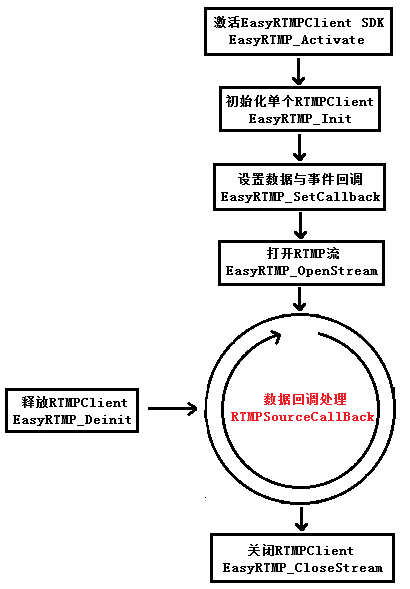

# EasyRTMPClient SDK #

EasyRTMPClient是EasyDarwin开源流媒体团队开发、提供的一套非常稳定、易用、支持重连接的RTMPClient工具，以SDK形式提供，接口调用非常简单。该EasyRTMPClient库未使用或参考现有的任何RTMP库，完全由EasyDarwin团队自主实现，因此，EasyRTMPClient更易于维护，稳定性、可扩展性得以提升，同时，本RTMP库全平台支持（包括windows/linux 32&64，ARM各平台，android, ios）!

## 调用示例 ##

- **EasyRTMPClient**: 以RTMPClient形式，从RTMP URL将音视频获取到本地；

    Windows编译方法，

    Visual Studio 2010编译：./win/EasyRTMPClient.sln
    
    Usage,
    
        EasyRTMPClientDemo.exe -i <rtmp-url>
        Help Mode: EasyRTMPClient.ext -h
        rtmp-url: source rtmp address
        For example: EasyRTMPClientDemo.exe -i rtmp://127.0.0.1/live/911
        
- **EasyPlayer调用**: EasyPlayer是由EasyDarwin开源团队开发和维护的一个多协议播放器项目，目前支持windows（支持多窗口、包含ActiveX，npAPI web插件）、Android平台，iOS平台，EasyRTMPClient作为其RTMP部分组件，为EasyPlayer提供稳定可靠、高兼容性的数据连接；

- **EasyClient**：EasyClient是EasyDarwin开源流媒体云平台的客户端实现，包含：Windows、Android、iOS三个部分，EasyRTMPClient为EasyClient提供RTMP协议支撑；

- **我们同时提供Windows、linux、ARM、Android、iOS版本的EasyRTMPClient库**：EasyRTMPClient SDK商业使用需要经过授权才能永久使用，商业授权方案可以邮件发送至[support@easydarwin.org](mailto:support@easydarwin.org "EasyDarwin support mail")或者通过电话Tel:**13718530929**进行更深入的技术与合作咨询；

## 调用流程 ##

## RTMPSourceCallBack数据回调说明 ##

EasyRTMPClient可以回调出多种类型的数据：

    #define EASY_SDK_VIDEO_FRAME_FLAG  /*视频帧数据*/
    #define EASY_SDK_AUDIO_FRAME_FLAG  /*音频帧数据*/
    #define EASY_SDK_EVENT_FRAME_FLAG  /*事件帧/日志数据*/
    
EASY_SDK_VIDEO_FRAME_FALG 数据可支持的视频格式：

    #define EASY_SDK_VIDEO_CODEC_H264
    
视频帧标识支持

    #define EASY_SDK_VIDEO_FRAME_I  /* I帧 */
    #define EASY_SDK_VIDEO_FRAME_P  /* P帧 */
    #define EASY_SDK_VIDEO_FRAME_B  /* B帧 */
    
> 当回调出RTSP_FRAME_INFO-codec为EASY_SDK_VIDEO_CODEC_H264数据，RTSP_FRAME_INFO->type为EASY_SDK_VIDEO_FRAME_I关键帧时，我们输出的数据结构为SPS+PPS+I的组合：

    |-----sps-----|-----sps-----|-------I Frame-------|
    |             |             |                     |
    |---------reserved1-----reserved2-------------length
    
EASY_SDK_AUDIO_FRAME_FLAG数据可支持多种音频格式：

    #define EASY_SDK_AUDIO_CODEC_AAC  /* AAC */
    #define EASY_SDK_AUDIO_CODEC_MP3  /* MP3 */
    
> **如果以上格式无法满足您的需求，可联系我们进行定制开发。**
    
## 获取更多信息 ##

邮件：[support@easydarwin.org](mailto:support@easydarwin.org) 

WEB：[www.EasyDarwin.org](http://www.easydarwin.org)

QQ交流群：[465901074](http://jq.qq.com/?_wv=1027&k=2G045mo "EasyRTSPClient")

Copyright &copy; EasyDarwin.org 2012-2017

    

        
        